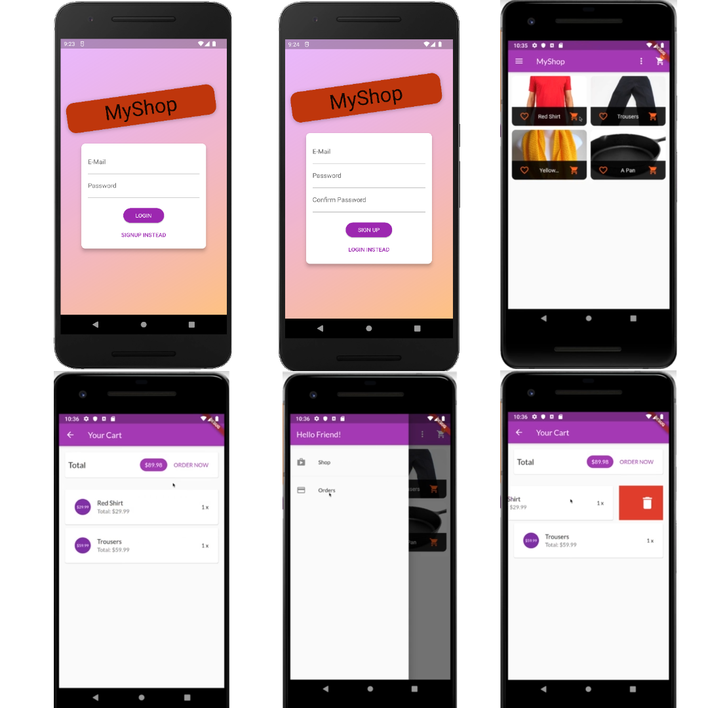

# Shopping App

Welcome to the Shopping App! This Flutter application allows users to browse and purchase products from various categories, manage their shopping cart, and complete the checkout process. It also includes user authentication using Firebase.

## Screenshots

Here are some screenshots of the app:

## Features

- Browse and search for products based on different categories.
- View detailed information about each product, including images, descriptions, and pricing.
- Add products to the shopping cart and manage the quantities.
- Proceed to checkout and complete the purchase.
- User authentication using Firebase to secure user accounts and manage login/logout functionality.

## Firebase Configuration

The Shopping App utilizes Firebase for user authentication. To configure Firebase for your app, follow these steps:

1. Create a Firebase project on the [Firebase console](https://console.firebase.google.com).
2. Retrieve your Firebase project URL and API key.
3. Open the `constants.dart` file in the project.
4. Update the following constants with your Firebase information:
- const kFirebaseUrl = "YOUR-URL-Firebase";
- const kFirebaseKey = "YOUR-KEY-Firebase";

5. Save the changes to the `constants.dart` file.

## Dependencies

This project uses the following dependencies:

- Flutter: [Link to Flutter](https://flutter.dev)
- Firebase: [Link to Firebase](https://firebase.google.com)

## Getting Started

To get started with the Shopping App, follow these steps:

1. Clone the repository .
2. Open the project in your preferred IDE or editor.
3. Make sure you have Flutter and the necessary dependencies installed.
4. Run `flutter pub get` to fetch the required dependencies.
5. Configure Firebase by following the Firebase setup instructions mentioned above.
6. Replace the placeholder API keys and credentials in the project with your own Firebase credentials.
7. Run the app using `flutter run` or using the IDE's built-in tools.

